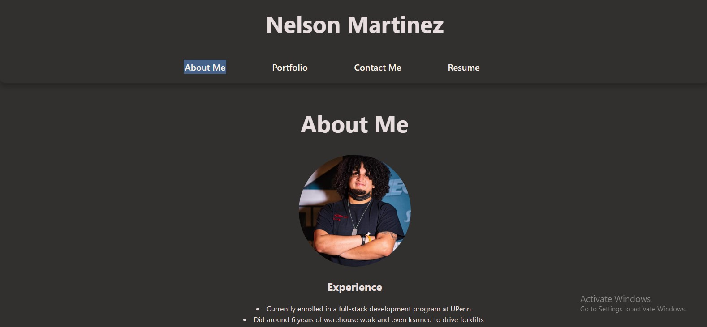

# Nelson's Portfolio

## Descryption

This is a portfolio made by me. Nelson Martinez. This was an assingment for UPENN>

## Table of Contents

1. [Installation](#installation)
2. [Usage](#usage)
3. [Credits](#credits)
4. [License](#license)
5. [Features](#features)
6. [How to Contribute](#contribute)
7. [Test](#test)
8. [Questions](#questions)

## Installation

N/A

## Usage

N/A

## Credits

I used React and vite to make this portfolio. Also used chatgpt.

## License

N/A

## Features

It's just a portfolio.

## How to Contribute

Dont contribute please.

## Test

N/A

## Questions

Github: [MartinezN2014](https://github.com/MartinezN2014)

Email: [Email](2014nmartinez@gmail.com)

